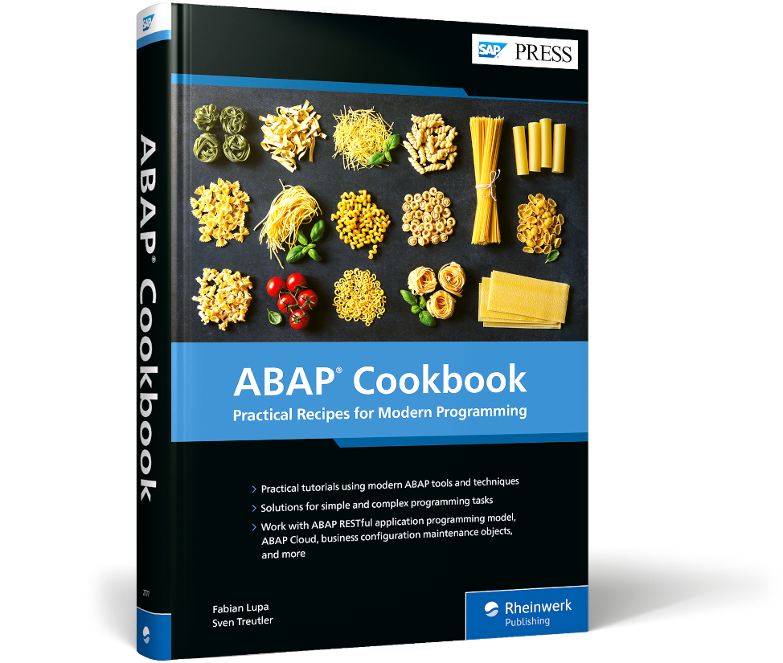
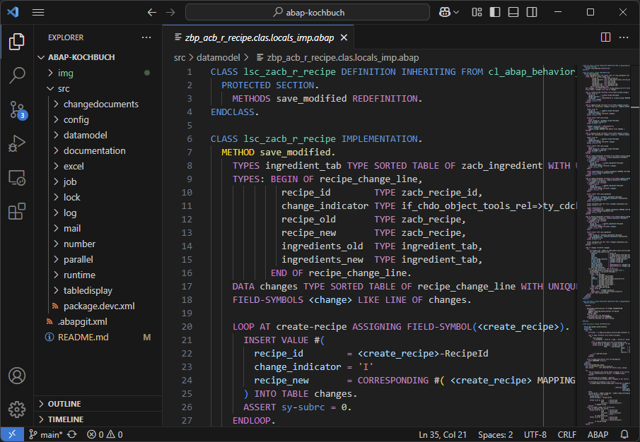

# ABAP Cookbook

Here you will find resources for the ABAP Cookbook (published in 2025 by SAP PRESS) as an abapGit repository.

> __🇺🇸 English Version__  
> This is the English version of the repository with original language `EN`. A German version with original language `DE` is also available [here 🇩🇪](https://github.com/abap-kochbuch/abap-kochbuch).

> __💡 Tip__  
> Are you looking for the resources from the predecessor, which was published in its second edition by SAP Press in 2016, [_Das ABAP-Kochbuch_](https://www.rheinwerk-verlag.de/das-abap-kochbuch-erfolgsrezepte-fuer-entwickler/)? You can find these resources [here](https://github.com/abapkochbuch/Sources).

> __☰ Contents__
> - [Chapter references](#chapter-references)
> - [Display in text editor/of IDE](#display-in-text-editor--ide)
> - [Installation in the SAP system](#installation-in-the-sap-system)
>   - [Prerequisites](#prerequisites)
>   - [🏠 Installation in SAP S/4HANA 2023 or SAP S/4HANA Cloud Private Edition 2023](#-installation-in-sap-s4hana-2023-or-sap-s4hana-cloud-private-edition-2023)
>     - [Installation of abapGit](#installation-of-abapgit)
>     - [Option A: Online repository](#option-a-online-repository)
>     - [Option B: Offline repository](#option-b-offline-repository)
>   - [☁️ Installation in SAP S/4HANA Cloud Public Edition or SAP BTP ABAP Environment](#️-installation-in-sap-s4hana-cloud-public-edition-or-sap-btp-abap-environment)
>     - [Installation of the abapGit plug-in for the ABAP Development Tools](#installation-of-the-abapgit-plug-in-for-the-abap-development-tools)
>     - [Installation of the online repository](#installation-of-the-online-repository)
>   - [Follow-Up Work](##follow-up-work)
> - [Creating new users](#creating-new-users)
> - [Troubleshooting](#troubleshooting)
>
> __💡 Tip__  
> In the GitHub web interface, you can click the unordered list icon  in the top right to display the navigation structure.

## Chapter References

The chapters refer to the following folders/sub-packages.

| No. | Chapter                                                        | Sub-Package                                  |
|-----|----------------------------------------------------------------|----------------------------------------------|
| 2   |	The Application Scenario	                                   | [`DATAMODEL`](./src/datamodel)               |
| 3   |	Handling System Fields and Runtime Information	               | [`RUNTIME`](./src/runtime)                   |
| 4   |	Table Analysis	                                               | [`TABLEDISPLAY`](./src/tabledisplay)         |
| 5   |	Table Maintenance Using Business Configuration Maintenance Objects  | [`CONFIG`](./src/config)                |
| 6   |	Application Logs	                                           | [`LOG`](./src/log)                           |
| 7   |	Change Documents	                                           | [`CHANGEDOCUMENTS`](./src/changedocuments)   |
| 8   |	Lock Objects	                                               | [`LOCK`](./src/lock)                         |
| 9   |	Number Range Objects	                                       | [`NUMBER`](./src/number)                     |
| 10  |	Background Processing	                                       | [`JOB`](./src/job)                           |
| 11  |	Email Dispatch	                                               | [`MAIL`](./src/mail)                         |
| 12  |	Parallelizing Application Logic    	                           | [`PARALLEL`](./src/parallel)                 |
| 13  |	File Upload	                                                   | [`DATAMODEL`](./src/datamodel) (extension)   |
| 14  |	Using Excel Files	                                           | [`EXCEL`](./src/excel)                       |
| 15  |	Documenting Development Objects	                               | [`DOCUMENTATION`](./src/documentation)       |
| 16  |	Authorizations	                                               | [`AUTHORIZATION`](./src/authorization)       |

## Display in Text Editor/IDE

Without an SAP system, you can view source code-based objects directly in the files in the [src/](./src/) folder. Plugins for syntax highlighting are recommended. For Visual Studio Code, you can find these in the [Standalone ABAP Development Extension Pack](https://marketplace.visualstudio.com/items?itemName=larshp.standalone-abap-development), for example. ABAP syntax highlighting is automatically available on the GitHub web interface.

## Installation in the SAP System

### Prerequisites

To install the software in your system, you need one of the following runtime environments. The link will take you to the relevant installation instructions.

- [SAP S/4HANA 2023](#-installation-in-sap-s4hana-2023-or-sap-s4hana-cloud-private-edition-2023) "On-Premise" (or later) _or_
- [SAP S/4HANA Cloud Private Edition 2023](#-installation-in-sap-s4hana-2023-or-sap-s4hana-cloud-private-edition-2023) (or later) _or_
- [SAP S/4HANA Cloud Public Edition](#️-installation-in-sap-s4hana-cloud-public-edition-or-sap-btp-abap-environment) _or_
- [SAP BTP ABAP Environment](#️-installation-in-sap-s4hana-cloud-public-edition-or-sap-btp-abap-environment)

> __💡 Tip__  
> If you do not have access to a suitable system, you can also use the free SAP BTP ABAP Environment Trial. To find out how to create an account and connect to the system, see the following tutorial: [Create an SAP BTP ABAP Environment Trial User](https://developers.sap.com/tutorials/abap-environment-trial-onboarding.html). To install this repository, follow the steps under [Installation in the SAP BTP ABAP Environment](#️-installation-in-sap-s4hana-cloud-public-edition-or-sap-btp-abap-environment).

### 🏠 Installation in SAP S/4HANA 2023 or SAP S/4HANA Cloud Private Edition 2023

#### Installation of abapGit

> Reference documentation: [Installation](https://docs.abapgit.org/user-guide/getting-started/install.html)

In SAP S/4HANA and SAP S/4HANA Cloud Private Edition, you use the community version of abapGit. It must be installed in the SAP system. You can check whether abapGit is already installed by calling transaction code `ZABAPGIT` or Report `ZABAPGIT_STANDALONE` or `ZABAPGIT` in the system. If abapGit is not yet installed, follow the instructions under [Installation](https://docs.abapgit.org/user-guide/getting-started/install.html) in consultation with your system administrators. The standalone version is sufficient for installing this repository.

This abapGit repository uses the ABAP language version _ABAP for Cloud Development_. Support for this ABAP language version is still quite new in abapGit. Therefore, make sure that you are using a current version of abapGit to avoid problems during installation.

You have two options for installing the repository:

- **[Option A: online repository](#option-a-online-repository)**  
  With the online repository, your SAP system connects to github.com to import the development objects. This requires an internet connection and the setup of SSL certificates.
- **[Option B: offline repository](#option-b-offline-repository)**  
  With the offline repository, you export the development objects yourself as a ZIP archive and import them manually into the system via file upload. No internet connection is required for this. However, you must repeat this manual step to update the repository.

#### Option A: Online Repository

> Reference documentation: [Installing Online Repo](https://docs.abapgit.org/user-guide/projects/online/install.html)

> __🌍 Internet connection and certificates__  
> To install an online repository, your SAP system must be able to connect to github.com. In addition to network connectivity, certificates must also be installed. For details on installing these certificates, see [SSL Setup](https://docs.abapgit.org/user-guide/setup/ssl-setup.html). For information on testing the connection, see [SSL Test](https://docs.abapgit.org/user-guide/setup/ssl-test.html).

1. Log on to the system using SAP GUI with the logon language English `EN`.
2. Start abapGit (e.g., via Transaction `SA38` and Report `ZABAPGIT_STANDALONE` or using Transaction Code `ZABAPGIT`).
3. Click on `New Online` at the top of the repository list.
4. Fill out the form as follows and confirm with _Create Online Repo_.  
      | Parameter                | Value                                           |
      |--------------------------|------------------------------------------------|
      | Git Repository URL       | https://github.com/abap-kochbuch/abap-kochbuch |
      | Package                  | `$COOKBOOK`                                    |
      | Branch                   | `english`                                         |
      | Folder Logic             | Prefix                                         |
      
      Keep all other parameters at their default values.

      > __💡 Note__  
      > Alternatively, you can use a Z package related to the transport system, `ZCOOKBOOK`.

5. Import the objects into the system. To do this, click on _Pull_ and select all objects in the dialog box that appears. These should all contain the description _Add local object_. Confirm by clicking _Continue_.  

6. Activate the objects. A pop-up window with your activation worklist will appear. The relevant objects should already be selected. Confirm by clicking _Next_.

7. A log will then appear. This will contain warnings and errors, which you can largely ignore. A sample log is shown below.  
    

    
Sample log

    <pre>
    Value table ZACB_LABEL is not active
    No root entity was found in this BO structure.
    Search help assignment for field ‘RecipeId’ is not inherited from base object
    Search help assignment for field ‘Username’ is not inherited from base object
    Search help assignment for field ‘LabelId’ is not inherited from base object
    No root entity was found in this BO structure.
    Annotation AccessControl in view ZACB_C_INGREDIENT not allowed because none in base view ZACB_R_INGREDIENT
    Annotation AccessControl in view ZACB_C_REVIEW not allowed because none in base view ZACB_R_REVIEW
    Value of annotation AccessControl in view ZACB_C_RECIPE differs from base view ZACB_R_RECIPE
    Annotation AccessControl in view ZACB_C_INGREDIENT not allowed because none in base V. ZACB_R_INGREDIENT
    Annotation AccessControl in view ZACB_C_REVIEW not allowed because none in base V. ZACB_R_REVIEW
    Ddl Source ZACB_C_INGREDIENT was enabled with warnings
    Ddl Source ZACB_C_RECIPE was enabled with warnings
    Ddl Source ZACB_C_REVIEW was enabled with warnings
    Ddl Source ZACB_I_LABELTEXT was enabled with warnings
    Ddl Source ZACB_R_REVIEW was enabled with warnings
    Domain ZACB_LABEL_ID was enabled with warnings
    Ddl Source ZACB_C_INGREDIENT was enabled with warnings
    Ddl Source ZACB_C_RECIPE was enabled with warnings
    Ddl Source ZACB_C_REVIEW was enabled with warnings
    Ddl Source ZACB_I_LABELS2TEXT was enabled with warnings
    Lead application of object 4F9AAAC1AF85701A29D36840344C4DHT does not exist
    Import of object 4F9AAAC1AF85701A29D36840344C4DHT failed
    Lead application of object DF11F804DF7836633258BF364C8D6CHT does not exist
    Import of object DF11F804DF7836633258BF364C8D6CHT failed
    Lead application of object F25AAD387E955B9D8EF69230A5417CHT does not exist
    Import of object F25AAD387E955B9D8EF69230A5417CHT failed
    Lead application of object F8EF7022FFDE645B8ECE5D0B7A485AHT does not exist
    Import of object F8EF7022FFDE645B8ECE5D0B7A485AHT failed
    </pre>
    

8. Continue with the [follow-up work](#follow-up-work).

#### Option B: Offline Repository

> Reference documentation: [Installing Offline Repo](https://docs.abapgit.org/user-guide/projects/offline/install.html)

1. Download the ZIP archive. You can find the download link on the publisher's website at [www.sap-press.de/6050](https://www.sap-press.de/6050) under the _Materials_ tab or at [github.com/abap-kochbuch/abap-kochbuch](https://github.com/abap-kochbuch/abap-kochbuch) via the _Code_ button and then the _Download ZIP_ link.
2. Start abapGit (e.g., via Transaction `SA38` and Report `ZABAPGIT_STANDALONE` or using Transaction Code `ZABAPGIT`).
3. Click on 'New Offline' at the top of the repository list.
4. Fill out the form as follows.  
      | Parameter                | Value                                          |
      |--------------------------|------------------------------------------------|
      | Name                     | ABAP Cookbook                          |
      | Package                  | `$COOKBOOK`                                    |
      | Folder Logic             | Prefix                                         |
      
      Keep all other parameters at their default values.

      > __💡 Note__  
      > Alternatively, you can use a Z package related to the transport system, `ZCOOKBOOK`.

5. Click on the _Create Package_ button and fill in the dialog box as follows. Then confirm by clicking _Next_.  
      | Parameter                | Value                                          |
      |--------------------------|------------------------------------------------|
      | Package                  | `$COOKBOOK`                                    |
      | Short Description        | ABAP Cookbook                          |
      | Software Component       | `LOCAL`                                        |
      | Transport Layer          | (blank)                                        |
      | Superpackage             | (blank)                                        |

6. Click the _Create Offline Repo_ button.

7. Click the _Import zip_ button and select the ZIP file you downloaded. Confirm any security prompts from SAP GUI.

8. Import the objects into the system. To do this, click on _Pull zip_ and select all objects in the dialog box that appears. These should all contain the description _Add local object_. Confirm by clicking _Continue_.  

9. Activate the objects. A pop-up window with your activation worklist will appear. The relevant objects should already have been selected. Confirm by clicking _Next_.

10. A log will then appear. This will contain warnings and errors, which you can largely ignore. A sample log is shown below.  
    

    
Sample log

    <pre>
        Value table ZACB_LABEL is not active
        No root entity is found in this BO structure.
        Search help assignment for field 'RecipeId' is not inherited from base object
        Search help assignment for field 'Username' is not inherited from base object
        Search help assignment for field 'LabelId' is not inherited from base object
        No root entity is found in this BO structure.
        Annotation AccessControl not allowed in view ZACB_C_INGREDIENT as base view ZACB_R_INGREDIENT has none
        Annotation AccessControl not allowed in view ZACB_C_REVIEW as base view ZACB_R_REVIEW has none
        Value of AccessControl annotation in view ZACB_C_RECIPE different in base view ZACB_R_RECIPE
        Annotation AccessControl not allowed in view ZACB_C_INGREDIENT as base view ZACB_R_INGREDIENT has none
        Annotation AccessControl not allowed in view ZACB_C_REVIEW as base view ZACB_R_REVIEW has none
        DDL Source ZACB_C_INGREDIENT was activated with warnings
        DDL Source ZACB_C_RECIPE was activated with warnings
        DDL Source ZACB_C_REVIEW was activated with warnings
        DDL Source ZACB_I_LABELTEXT was activated with warnings
        DDL Source ZACB_R_REVIEW was activated with warnings
        Domain ZACB_LABEL_ID was activated with warnings
        DDL Source ZACB_C_INGREDIENT was activated with warnings
        DDL Source ZACB_C_RECIPE was activated with warnings
        DDL Source ZACB_C_REVIEW was activated with warnings
        DDL Source ZACB_I_LABELS2TEXT was activated with warnings
        Lead application of object 4F9AAAC1AF85701A29D36840344C4DHT does not exist
        Import of object 4F9AAAC1AF85701A29D36840344C4DHT failed
        Lead application of object D606B844E24E337A33876FDFD7B6C6HT does not exist
        Import of object D606B844E24E337A33876FDFD7B6C6HT failed
        Lead application of object DF11F804DF7836633258BF364C8D6CHT does not exist
        Import of object DF11F804DF7836633258BF364C8D6CHT failed
        Required object &S_START& missing for &F25AAD387E955B9D8EF69230A5417C& &F25AAD387E955B9D8EF69230A5417C&
        Import of object F25AAD387E955B9D8EF69230A5417CHT failed
        Lead application of object F8EF7022FFDE645B8ECE5D0B7A485AHT does not exist
        Import of object F8EF7022FFDE645B8ECE5D0B7A485AHT failed
        Lead application of object FF924B61589943257B60687C18D4FDHT does not exist
        Import of object FF924B61589943257B60687C18D4FDHT failed
    </pre>
    

11. Continue with the [follow-up work](#follow-up-work).

### ☁️ Installation in SAP S/4HANA Cloud Public Edition or SAP BTP ABAP Environment

> Reference documentation: [Import Content from abapGit Repository into the ABAP Environment](https://help.sap.com/docs/btp/sap-business-technology-platform/import-content-from-abapgit-repository-into-abap-environment)

#### Installation of the abapGit Plug-in for the ABAP Development Tools

The SAP version of abapGit is already installed in SAP S/4HANA Cloud Public Edition and in the SAP BTP ABAP environment. All you need is the plug-in to use abapGit in the ABAP Development Tools. To do this, follow the steps in the tutorial [Install the abapGit Plugin].(https://developers.sap.com/tutorials/abap-install-abapgit-plugin..html).

#### Installation of the Online Repository

1. Log on to the ABAP Development Tools with the logon language English `EN`. If necessary, create a new ABAP Cloud project so that you can specify the language.  

    > __📋 Check in the trial system__  
    > If you are using the trial system from SAP BTP ABAP environment, it is worth checking first whether someone else has already installed the application in the system. To do this, search for the `ZACB_UI_RECIPE_O4` service binding using <kbd>Ctrl</kbd> + <kbd>Shift</kbd> + <kbd>A</kbd>, for example. If you do not get any hits, you can continue with the installation.

2. Create a new package.

    1. Right-click on the ABAP project in the project explorer and select _New -> ABAP Package_ from the context menu. A dialog box opens.

    2. Assign the following parameter values and confirm by clicking _Next_.
        | Parameter                | Value                  |
        |--------------------------|------------------------|
        | Name                     | `ZCOOKBOOK`            |
        | Description              | ABAP Cookbook  |
        | Original Language        | `EN`                   |
        | Add to favorite packages | ✅                     |
        | Superpackage             | `ZLOCAL`               |
        | Package Type             | Development            |

    3. In the next step, assign the following parameter values and confirm by clicking _Next_:
        | Parameter                | Value    |
        |--------------------------|----------|
        | Software Component       | `ZLOCAL` |
        | Application Component    | (blank)  |
        | Transport Layer          | (blank)  |

    4. Then create a new transport request (_Create a new request_) or select an existing one. Confirm by clicking _Finish_.

3. Clone the repository and import the objects.

    1. Open the _abapGit Repositories_ view in the ABAP Development Tools. If it is not yet displayed, select tWindow -> Show View -> Other... from the menu. Select _abapGit Repositories_ from the list.

    2. Click on the plus icon in the top right-hand corner of the view. (_Link New abapGit Repository_).

    3. Enter the following URL in the dialog box and confirm by clicking _Next_: `https://github.com/abap-kochbuch/abap-kochbuch`

    4. Select the following parameter values and confirm by clicking _Next_:
        | Parameter                | Value                  |
        |--------------------------|------------------------|
        | Branch                   | `refs/heads/english`      |
        | Package                  | `ZCOOKBOOK`            |
        | Pull after link          | ✅                     |
    
    5. Confirm by clicking _Next_ to automatically determine the `PREFIX` folder logic.

    6. Confirm the automatically selected transport request from the package creation by clicking _Finish_.

    7. Select the check box next to _Repository: abap-cookbook_ to select all entries in the hierarchy and confirm by clicking _Finish_.

    8. Check the status of the pull action by clicking on the refresh icon in the upper right-hand corner of the _abapGit Repositories_ view. If necessary, you can enable a filter using the button to the right of _My Repositories_ so that the list only contains repositories linked by you. Check the _Status_ column and refresh until the status changes to _Pull running..._.

        > __🔍 Error analysis__  
        > If the status changes to _Pull aborted_, right-click on the entry and select _Show Object Log..._ to analyze the error. See also [Troubleshooting](#troubleshooting).

4. Activate the imported objects.

    1. Click on the _Activate inactive ABAP Development Objects_ icon or press the keyboard shortcut <kbd>Ctrl</kbd> + <kbd>Shift</kbd> + <kbd>F3</kbd>. Select the transport request you want and confirm with _Activate_. Wait until the mass activation is complete. You can track the status at the bottom right.

    2. In the project explorer, update the `ZCOOKBOOK` package by selecting it with the left mouse button and then pressing the <kbd>F5</kbd> function key.

5. Continue with the [follow-up work](#follow-up-work).

### Follow-Up Work

1. In the ABAP Development Tools, open the `ZACB_UI_RECIPE_O4` service binding, for example, using the keyboard shortcut <kbd>Ctrl</kbd> + <kbd>Shift</kbd> + <kbd>A</kbd>. Press the _Publish_ button and wait until the status after _Local Service Endpoint_ changes from _Unpublished_ to _Published_.  
    > __🏠 SAP S/4HANA or SAP S/4HANA Cloud Private Edition__  
    > If you receive an error message stating that the binding cannot be published, open Transaction `/IWFND/V4_ADMIN` in SAP GUI.
    > 1. Click the _Publish service groups_ button.
    > 2. Select your system alias, usually `LOCAL`, and enter `ZACB*` as the service group ID.
    > 3. Click on _Get service groups_.
    > 4. Select the `ZACB_UI_RECIPE_O4` item and click on the _Publish service groups_ button.
    > 5. Confirm the subsequent dialog box by clicking _Next_. You can then exit the transaction.
    >
    > After a refresh using the <kbd>F5</kbd> key, the service binding should now display the _Published_ status in the ABAP Development Tools.

1. Repeat the process for the `ZACB_UI_MASS_CHANGE_O4` service binding.

1. Open the `ZCL_ACB_DEMO_GENERATOR` class and run it as an ABAP console application using the <kbd>F9</kbd> function key. The class generates test data in the database tables of the recipe portal.

## Creating New Users

The demo data generator in class `ZCL_ACB_DEMO_GENERATOR` creates a user master record in database table `ZACB_USER` for the executing user. This entry is used for authorization checks. If other developers use the application in the same system, they must create their own master records as follows.

1. Open the `ZCL_ACB_ADD_USER` class, for example, using the keyboard shortcut <kbd>Ctrl</kbd> + <kbd>Shift</kbd> + <kbd>A</kbd>.
2. Run the class as an ABAP console application using the <kbd>F9</kbd> function key. The user master record will be created for the user that is currently logged on.

> 💡 Note  
> Running the demo data generator again would delete the other user master records.

## Troubleshooting

### The Repository Object Generator displays the error message “The use of ... is not permitted.” (🏠)

This is an issue in combination with the ABAP language version _ABAP for Cloud Development_ and local $ packages. Import SAP Note [3537063](https://me.sap.com/notes/3537063) into your system.

### The CL_ABAP_BEHAVIOR_SAVER_FAILED class has not been released. (🏠)

Import SAP Note [3409039](https://me.sap.com/notes/3409039) into your system.

### The methods for adding worksheets are missing in the XCO component for Excel files. (🏠)

Import SAP Note [3564421](https://me.sap.com/notes/3564421) into your system.

### The `TOBJ` object type is not supported in the SAP BTP ABAP environment and in SAP S/4HANA Cloud Public Edition by the SAP version of abapGit. (🌥️)

A workaround for creating the `TOBJ` object used in the Business Configuration Maintenance App can be found in the following blog: [How to import a BC app based on RAP/SMBC/TOBJ with abapGit](https://community.sap.com/t5/technology-blog-posts-by-sap/how-to-import-a-bc-app-based-on-rap-smbc-tobj-with-abapgit/ba-p/14060299).

### The objects cannot be activated in the SAP BTP ABAP environment or in SAP S/4HANA Cloud Public Edition. (🌥️)

For details on error analysis with the SAP version of abapGit in the SAP BTP ABAP environment and in SAP S/4HANA Cloud Public Edition, see the SAP Help Portal at [Restrictions and Errors](https://help.sap.com/docs/sap-btp-abap-environment/abap-environment/working-with-abapgit#restrictions-and-errors).

### The SAP version of abapGit displays a pull error in the ABAP Development Tools. (🌥️)

For details on error analysis with the SAP version of abapGit in the SAP BTP ABAP environment and in SAP S/4HANA Cloud Public Edition, see the SAP Help Portal at [Restrictions and Errors](https://help.sap.com/docs/sap-btp-abap-environment/abap-environment/working-with-abapgit#restrictions-and-errors).

### The SAP version of abapGit has created objects in the SAP BTP ABAP environment or in SAP S/4HANA Cloud Public Edition with the ABAP language version _Standard ABAP_ that cannot be edited. (🌥️)

These are bugs in the implementation of the SAP version of abapGit. Open a message in SAP in application component `BC-CP-ABA-GIT` to clean up/edit the objects.

### The `CL_MAIL_ADDRESS` class has not been released in the SAP BTP ABAP Environment Trial. (🌥️)

Some development objects are generally available and released in ABAP Cloud, but cannot be used in the trial system and therefore trigger syntax errors. To activate them, you must comment out the corresponding code lines in the trial system. In this repository, this affects the `CL_MAIL_ADDRESS` class.

### I receive the runtime error `BEHAVIOR_ILLEGAL_STATEMENT` in the Business Configuration App

The built-in validation in the Business Configuration Maintenance App uses the XCO library to check foreign keys. However, it is no longer capable of validating database tables in temporary packages. Depending on the chosen installation variant and runtime environment, the validation check therefore fails with an internal error.

As a workaround, you can install the application in a transportable package (e.g., `ZCOOKBOOK`), release the database table `ZACB_LABEL` via a C1 release contract with “Use in Cloud Development,” or comment out the validation check in the method `VALIDATEDATACONSISTENCY` in the local class include of the global class `ZBP_ACB_I_LABEL_S`.

For details about the error, please refer to the note [3671779 – Maintenance Object (SMBC) Wizard: Runtime error in consistency check](https://me.sap.com/notes/3671779/E).
